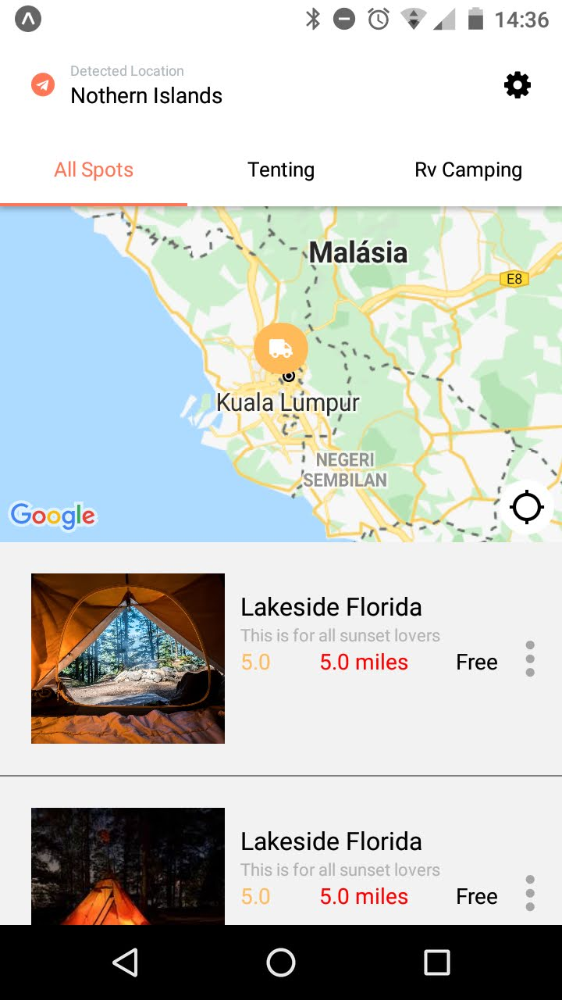

<h4 align="center">
  Camping Spots Finder
</h4>

  

  

  <a href="">Tecnologias</a> &nbsp; &nbsp; | &nbsp; &nbsp;
  <a href="">Projeto</a> &nbsp; &nbsp; | &nbsp; &nbsp;
  <a href="">Licença</a>

## Tecnologias

- [Node.js](https://nodejs.org/en/)
- [React](https://reactjs.org)
- [React Native](https://facebook.github.io/react-native/)
- [Expo](https://expo.io/)

## Projeto

[Design - Kishore](https://project365.design/2018/12/30/day-364-camping-spots-finder-app/)

## Licença

This project is under MIT license.